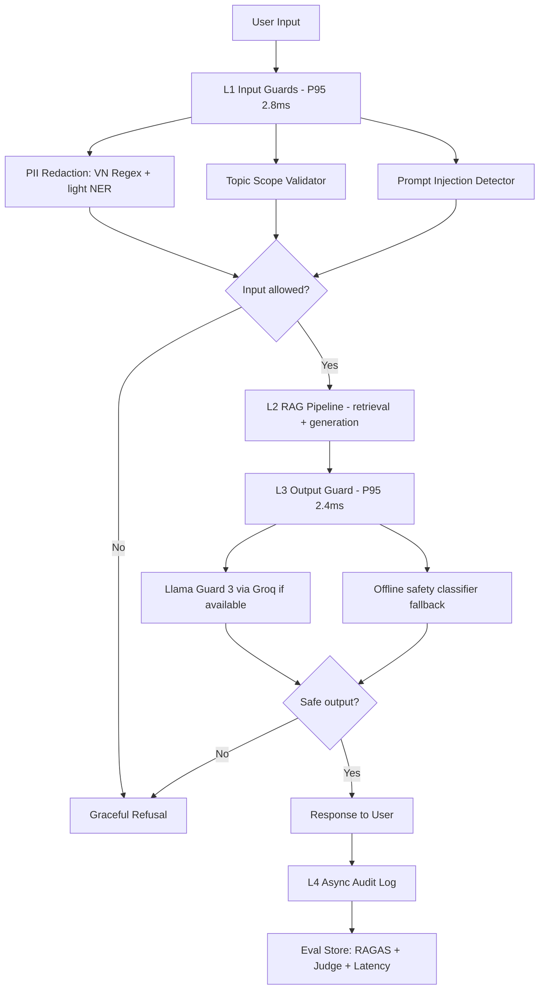

# Production Evaluation and Guardrail Blueprint

## 1. SLO Definition

| Metric | Target | Alert Threshold | Severity |
|---|---:|---:|---|
| Faithfulness | >= 0.85 | < 0.80 for 30 min | P2 |
| Answer Relevancy | >= 0.80 | < 0.60 for 30 min | P2 |
| Context Precision | >= 0.70 | < 0.65 for 1h | P3 |
| Context Recall | >= 0.75 | < 0.70 for 1h | P3 |
| P95 Latency with guardrails | < 2.5s | > 3s for 5 min | P1 |
| Input Guardrail Detection Rate | >= 90% | < 85% daily eval | P2 |
| Output Guardrail False Positive Rate | < 5% | > 10% daily eval | P2 |

Current Phase A result: context precision and recall pass target after full-corpus retrieval. Answer relevancy is still below target, so this system should be monitored but not used as a hard production quality gate until the synthetic multi-context questions and answer framing are improved.

## 2. Architecture Diagram

The stack uses defense in depth. L1 prevents unsafe or out-of-scope input from reaching the model. L2 performs retrieval and grounded generation. L3 checks the model output before the user sees it. L4 logs audit data asynchronously so logging does not affect the online latency budget.

## 3. Alert Playbook

### Incident: Faithfulness drops below 0.80

**Severity:** P2  
**Detection:** Continuous RAGAS eval alert.

**Likely causes:**
1. Generator adds bridging claims not explicitly stated in retrieved chunks.
2. Prompt changed and stopped enforcing context-only answers.
3. Retrieved context is correct but too broad, allowing unsupported synthesis.

**Investigation steps:**
1. Inspect bottom 10 faithfulness rows in `phase-a/failure_analysis.md`.
2. Compare current prompt to last passing prompt.
3. Check whether multi-context questions have vague wording such as "cho thấy điều gì".
4. Review answers for claims not present in retrieved chunks.

**Resolution:**
- Roll back prompt if there was a prompt drift.
- Add quote-first generation and require `Evidence 1`, `Evidence 2`, `Conclusion`.
- Add a claim checker before output.

**SLO impact:** Track time to detect and time to recover; rerun A.2 after the fix.

### Incident: Answer relevancy remains below 0.60

**Severity:** P2  
**Detection:** RAGAS summary or eval gate failure.

**Likely causes:**
1. Synthetic questions are vague or unnatural.
2. Answer does not reuse the key noun phrase from the question.
3. Judge model penalizes broad synthesis across unrelated contexts.

**Investigation steps:**
1. Break down answer relevancy by `evolution_type`.
2. Manually inspect 10 multi-context questions.
3. Compare answer against `ground_truth` and question wording.

**Resolution:**
- Rewrite multi-context questions as explicit comparison questions.
- Add direct-answer prompt rule: first sentence must answer the exact question.
- Keep a separate eval slice for natural user questions.

**SLO impact:** Do not block deployment solely on synthetic multi-context failures until reviewed by humans.

### Incident: Guardrail detection drops below 85%

**Severity:** P2  
**Detection:** Daily adversarial regression test.

**Likely causes:**
1. New jailbreak pattern not covered by regex or Llama Guard.
2. Topic validator keywords are too narrow.
3. Output guard fallback is being used when Llama Guard API is unavailable.

**Investigation steps:**
1. Open `phase-c/adversarial_test_results.csv`.
2. Group failures by `attack_type`.
3. Check whether Groq/Llama Guard API was enabled or fallback was used.

**Resolution:**
- Add failing payload pattern to injection detector.
- Expand topic guard allowed terms only for legitimate domain queries.
- Re-enable Llama Guard API or deploy a local model endpoint.

**SLO impact:** Keep a rolling adversarial set and require 90% detection before release.

### Incident: P95 latency exceeds 3 seconds

**Severity:** P1  
**Detection:** Online latency dashboard.

**Likely causes:**
1. LLM generation or Llama Guard API network latency.
2. Guardrails running sequentially instead of concurrently.
3. Audit logging blocking user response.

**Investigation steps:**
1. Compare L1, L2, and L3 timings in `phase-c/latency_benchmark.csv`.
2. Check API status and retry rate.
3. Verify audit log is fire-and-forget.

**Resolution:**
- Run L1 and L3 checks in parallel.
- Cache topic embeddings or use keyword fallback.
- Move audit logging to queue.
- Use lower-latency output guard for low-risk responses.

**SLO impact:** P1 because user-facing latency affects all requests.

## 4. Cost Analysis

Assumption: 100k user queries/month, 1% sampled for continuous RAGAS, 10% sampled for LLM judge tier-2, 1% escalated to stronger judge.

| Component | Unit Cost | Volume | Monthly Cost |
|---|---:|---:|---:|
| RAG generation with GPT-4o-mini | $0.001/query | 100k | $100 |
| RAGAS continuous eval sample | $0.01/query | 1k | $10 |
| LLM judge tier-2 | $0.001/query | 10k | $10 |
| LLM judge tier-3 escalation | $0.05/query | 1k | $50 |
| Input guardrails | self-hosted | 100k | $0 |
| Llama Guard via API/fallback | $0.0005/query | 100k | $50 |
| Audit log storage | $0.02/GB | 20GB | $0.40 |
| **Total** |  |  | **$220.40** |

Cost optimization opportunities:
- Sample RAGAS on 1% of traffic and increase only during releases.
- Use LLM judge only for drift monitoring, not every request.
- Route low-risk outputs to offline classifier and high-risk outputs to Llama Guard.
- Cache retrieval results for repeated tax/legal FAQ questions.
